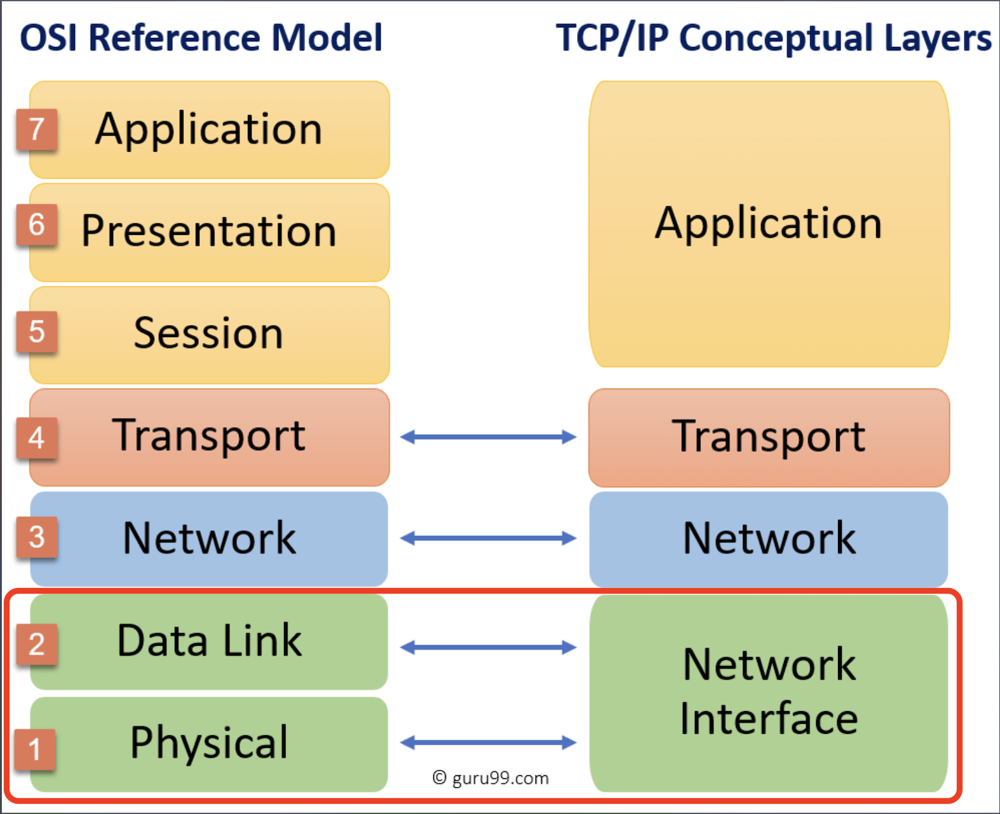

# 01. 네트워크 레이어

# OSI 7계층

OSI 7계층과 TCP/IP 4계층은 위와 같은 구조로 이루어져 있습니다.

## OSI 1계층(물리계층)

- 물리적으로 연결되어 있는 기기에 대한 신호 전달을 수행하는 계층
- 데이터 링크 계층의 프레임을 받아서, 구리 or 광섬유 or 무선 통신 매체를 통해 전송하기 위한 전기신호로 바꾸어 줍니다.
- 해당 계층에서는 물리적 매체에 대해서 요구되는 기능들을 정의하고, USB 케이블, 동축 케이블 등 두 디바이스 간의 실제 접속을 위한 기계적, 전기적 특성에 대한 규칙을 정의합니다.

| 제목             | 내용                     |
| ---------------- | ------------------------ |
| 데이터 전송 단위 | 비트(bit)                |
| 프로토콜         | RS-232, RS-449 등 케이블 |
| 장비             | 허브, 리피터             |

### 허브 vs 리피터

**리피터**는 단일 포트에 대해서 전기 신호를 복원하고 증폭하는 기능을 가진 네트워크 중계 장비입니다.

**허브**는 여러 개의 포트를 가지고 있고, 리피터의 기능을 동일하게 수행을 합니다. 하지만, 특정 포트로 데이터를 받았을 때 해당 포트를 제외한 나머지 모든 포트에도 데이터를 전송한다는 문제가 있습니다.  
따라서, **더미 허브**라는 이름으로 불리기도 합니다.

## OSI 2계층(데이터링크 계층)

- 네트워크 계층 패킷 데이터를 물리적 매체에 실어 보내기 위한 계층
- 두 포인트 간의 신뢰성있는 전송을 보장하기 위한 계층
- 신뢰성있는 전송을 위해 오류 검출 및 회복을 위한 오류 제어 기능을 수행
- 송수신측의 속도 차이 해결을 위해 흐름 제어 기능 수행

| 제목             | 내용                |
| ---------------- | ------------------- |
| 데이터 전송 단위 | 프레임(frame)       |
| 프로토콜         | Ethernet, HDLC 등등 |
| 장비             | 브릿지, 스위치      |

### MAC 주소란

- 랜카드에 할당된 전 세계에서 유일한 번호로 물리 주소입니다.
- MAC 주소는 LAN 카드에 위치합니다.

### Ethernet protocol

- 이더넷 프로토콜은 랜에서 데이터를 주고받기 위한 규칙으로, 허브와 같은 장비에 연결된 컴퓨터와 데이터를 주고 받을 때 사용합니다.

- 이때, 고유의 MAC 주소를 가지고 상호간에 데이터를 주고 받을 수 있도록 만들어졌으며, 이더넷에서는 수신처 MAC 주소를 보고 자기에게 온 것만 받고 다른 프레임은 파기합니다.

### MAC 주소 테이블에 주소가 존재하지 않을 경우

- MAC 주소 테이블에 등록되어 있지 않은 MAC 주소가 들어오면, 송신 포트를 제외한 모든 포트에 데이터를 전송합니다. 이를 **flooding** 이라고 합니다.

MAC 주소 테이블 (MAC address table)

- 스위치의 포트 번호와 해당 포트에 연결되어 있는 컴퓨터의 MAC 주소가 저장된 데이터베이스입니다.
  스위치에 연결된 컴퓨터가 프레임(데이터)을 전송하면 MAC 주소 테이블을 확인하고 해당 포트로 전송합니다.
- 만약 테이블에 저장되지 않는 주소라면, MAC 주소와 포트 번호를 데이터베이스에 정보를 저장 합니다.
- 이를 MAC 주소 학습 기능이라고 하고, 허브에는 없는 기능입니다.

### 데이터 링크 계층에서의 트레일러

- 트레일러(FCS) 가 붙습니다.
- 트레일러는 데이터 뒤에 붙고, FCS(Frame Check Sequence)라고 부르기도 합니다.
- FCS는 데이터 전송 도중 오류가 발생하는지 확인하는데 사용됩니다.
- 다른 계층에선 단순히 헤더 하나씩만 추가되는데 데이터 링크에서는 FCS 가 추가적으로 붙습니다.
  

### 네트워크 캐스팅

#### 유니 캐스트
출발지와 목적지가 정확해야 하는 일대일 통신입니다.

#### 애니 캐스트
가장 가까운 노드와 통신하는 방식입니다. 애니캐스트는 트래픽 분산, 네트워크 이중화, DDos 공격 시 서버가 받는 피해 최소화, Response Time 최소화를 목적으로 사용됩니다.

#### 멀티 캐스트
특정 그룹을 지정해서 해당 그룹원에게만 보내는 방식을 사용합니다. 이때, 스위치 혹은 라우터가 멀티캐스트를 지원해야 합니다.

#### 브로드 캐스트
같은 네트워크에 있는 모든 장비들에게 보내는 통신입니다.
주로, 상대의 IP는 알지만 MAC을 모를 경우에 사용됩니다. DHCP도 브로드캐스트로 동작합니다.

### 출처

- https://www.guru99.com/layers-of-osi-model.html
- https://velog.io/@minj9_6/%EB%A6%AC%ED%94%BC%ED%84%B0%EC%99%80-%ED%97%88%EB%B8%8C%EC%9D%98-%EA%B5%AC%EC%A1%B0
