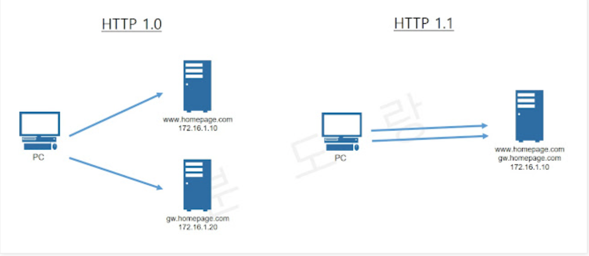

# HTTP

- 인터넷에서 클라이언트, 서버간 데이터와 리소스를 교환 할 수 있게 해주는 기본 프로토콜
- 요청과 응답이 이전 요청, 응답과 독립적인 stateless한 프로토콜

## HTTP 특징
- 클라이언트-서버 구조
- 무상태 프로토콜, 비연결성
- HTTP 메시지
- 단순함, 확장가능

### 무상태 프로토콜
서버가 클라이언트의 상태를 보존하지 않은 것을 의미.  
**[장점]** : 서버의 확장성이 높아진다.  
**[단점]** : 클라이언트가 추가 데이터를 전송해야 한다.

**cf) stateful 하다면?**
- 서버의 이전 상태를 저장
- 갑자기 서버가 변경되면 지금까지 왔던 요청을 모름.
- 서버가 죽으면 지금까지 보내왔던 요청이 소멸 됨.

### 비연결성
HTTP 프로토콜은 기본적으로 비연결성을 추구 함. 한 번의 연결이 수립하여 요청과 응답이 오가면 연결을 끊음.

하지만 이 과정에서 서버와 다시 통신 할 때 3-way-handshake 과정이 계속 발생하면서 효율이 떨어짐.

HTTP 1.1 에서는 이러한 문제를 keep-alive를 도입하여 해결

## HTTP Status Code
HTTP 상태 코드는 클라이언트가 보낸 요청의 처리 상태를 응답에서 알려주는 기능.  
HTTP 상태 코드는 총 5가지로 분류 됨.

- **1xx(Informational)** : 요청이 수신되어 처리 중 (거의 사용을 하지 않음.)
- **2xx(Successful)** : 요청 정상 처리
- **3xx(Redirection)** : 요청을 완료하려면 추가적인 행동이 필요
- **4xx(Client Error)** : 클라이언트 오류, 클라이언트의 오류로 서버가 요청을 수행 할 수 없음.
- **5xx(Server Error)** : 서버가 정상 요청을 처리하지 못함.

### 각 분류 별 주요 상태 코드

#### 2xx
- **200 OK** : 정상 처리
- **201 Created** : Post 등록에 사용되고, Location 헤더가 추가 됨.
- **202 Accepted** : 요청이 접수 되었으나 처리가 되지 않음, 배치 혹은 메시징 큐
- **204 No Content** : 서버가 요청을 정상 수행 했지만, 응답 값이 없음.

#### 3xx

#### 영구 리다이렉션
특정 리소스의 URI가 영구적으로 이동
- **301 : Moved Permanently** : 영구 리다이렉션, 요청 메서드가 GET으로 변하고(무조건 X), 본문이 제거 될 수 있음.
- **308 : Permanent Redirect** : 리다이렉트시 요청 메서드와 본문 유지(처음 POST를 보내면 리다이렉트도 동일)

#### 일시적 리다이렉션
리소스의 URI가 일시적으로 변경되고 검색엔진 등에서 URL을 변경하면 안된다.
- **302 Found** : 리다이렉트 시 요청 메서드가 GET으로 변하고(무조건 X), 본문이 제거될 수 있음.
- **303 See Other** : 302와 기능적으로 동일하나 반드시 GET으로 변경
- **307 Temporary Redirect** : 리다이렉트시 요청 메서드와 본문 유지

#### 기타
- **304 Not Modified** : 캐시를 목적으로 사용되고, 리소스가 수정되지 않았음을 알리고 캐시 사용을 권장

**리다이렉션 종류**
1. 영구 리다이렉션 : 
2. 일시 리다이렉션 : 일시적인 변경
3. 특수 리다이렉션 : 결과 대신 캐시를 사용

#### 4xx
- **400 Bad Request** : 클라이언트가 잘못된 요청을 해서 서버가 요청을 처리 할 수 없는 상황
- **401 Unauthorized** : 클라이언트가 해당 리소스에 대한 인증이 필요함 (인증 오류, 응답에 www-authenticate 헤더와 함께 인증 방법을 명시해야 함)
- **403 Forbidden** : 서버가 요청을 이해했지만 승인 거부 (인가 오류)

#### 5xx
- **500 Internal Server Error** : 서버 문제로 오류 발생
- **503 Service Unavailable** : 서버가 일시적인 과부하 및 예정된 작업으로 잠시 요청 처리 못하는 상황 (Retry-After 헤더 필드로 얼마 뒤에 복구되는지 명시가능 보통 안 씀.)

## HTTP Method
HTTP 메서드는 클라이언트와 서버 사이에 이뤄지는 요청과 응답 데이터를 전송하는 방식을 말합니다.  
HTTP 메서드는 총 9가지가 있습니다.
- **GET** : 리소스 조회
- **POST** : 요청 데이터 처리
- **PUT** : 리소스를 대체, 해당 리소스가 없으면 생성
- **PATCH** : 리소스 부분 변경
- **DELETE** : 리소스 삭제
- **HEAD** : GET과 동일하지만, 상태 줄과 헤더만 반환합니다.
- **OPTIONS** : 대상 리소스에 대해서 통신이 가능한지 식별합니다. CORS PreFlight에서 사용합니다.
- **CONNECT** : 대상 자원으로 식별되는 서버에 대한 터널을 설정합니다.
- **TRACE** : 대상 리소스에 대한 경로를 따라 메시지 루프백 테스트를 수행

### HTTP 메서드의 속성

#### 멱등성
**f(f(x)) = f(x)** 한 번 호출하든 두 번 호출하든 100번 호출하든 결과가 똑같음을 의미.
- 데이터를 중간에 변경하지 않는다는 가정

1. GET, PUT, DELETE는 멱등성이 보장된다. (여러 번 실행해도 같은 결과를 반환)
2. POST, PATCH는 멱등성이 보장되지 않는다. (최종 결과가 달라 질 수가 있다.)

#### 캐시가능
응답결과 리소스를 캐시해서 사용하는 것이 가능하다.
1. GET, HEAD, POST, PATCH는 캐시가 가능하다. 그러나, 실제로는 GET, HEAD 만 사용한다. POST, PATCH는 본문 내용까지 고려해야 하기 때문이다.

## HTTP 1.1
HTTP 1.0에서 비연결성으로 인한 문제로 인해 이를 해결하기 위한 연결 방식인 **Persistent Connection**이 등장

#### Persistent Connection
3-way-handshake를 통한 TCP 연결을 재활용 하는 원리를 의미한다. Connection 헤더에 keep-alive가 명시된다. 만약 연결을 해제하고 싶다면 Connection: close라는 명시적 헤더를 이용하여 연결을 끊을 수 있다.

#### 호스트 헤더
호스트 헤더의 등장으로 하나의 IP에 여러 개의 도메인을 운영 할 수 있게 되었다.

## HTTP 2.0
HTTP 1.1에서 Persistent Connection이 등장하여 어느정도 성능이 개선되었지만 그 과정에서 HOL(Head-Of-Line) 문제가 발생하였다. 이를 해결하기 위해 Multiflexing이 등장

#### HOL(Head-Of-Line)
앞에 처리가 오래걸리는 패킷이 있으면 오랜시간 기다리게 되는 호위현상이 발생, HTTP 2.0은 이를 방지하고자 병렬 처리를 하여 한 번에 처리하고, 요청에 대해 우선순위를 정할 수 있게 되었다.

#### 헤더 압축
HTTP 1.1도 어느정도 헤더를 압축하여 헤더의 사이즈가 줄어들었지만, HTTP 2.0에서는 **HPACK**이라는 고급 압축 방식을 사용하여 HTTP 패킷의 양을 줄여 웹 페이지를 로드하는 속도를 향상시킴.

# HTTPS
HTTP에 Secure Socket이 추가된 것. HTTPS는 서버와 클라이언트 사이의 모든 통신 내용이 암호화 되어있다.

HTTPS에서 인증서를 사용하게 된 계기는 암호화를 이용하여 데이터를 보호하기 위함이다. 이를 이용해 다음을 보호 할 수 있다.
1. 스니핑
2. 데이터 변조
3. 피싱

## SSL/TLS 동작 방식
  
1. 먼저 서버는 CA(Certificate Authority)에게 일정 금액을 제공하고 SSL 인증서를 받습니다.
2. 클라이언트가 서버에게 메시지를 전송합니다. 메시지에는 TLS버전, 암호화 알고리즘, 무작위 바이트 문자열이 포함됩니다.
3. 서버가 클라이언트에게 메시지를 전송합니다. 메시지에는 SSL 인증서, 선택한 암호화 알고리즘, 무작위 바이트 문자열이 포함됩니다.
4. 클라이언트는 해당 SSL 인증서가 신뢰할만한지 CA에 검증합니다.
5. 클라이언트는 서버에서 제공한 무작위 바이트 문자열을 서버의 공개키로 암호화된 premaster secret key를 서버에 전송합니다.
6. 서버는 premaster secret key를 개인키로 복호화합니다.
7. 클라이언트와 서버는 클라이언트의 무작위 바이트 비트열, 서버의 무작위 바이트 비트열, premaster secret key를 통해 검증하고, 세션 키를 생성합니다. 이때, 양쪽 다 같은 키(대칭키)가 생성됩니다.
8. 클라이언트는 세션 키로 암호화된 완료 메시지를 전송합니다.
9. 서버도 세션 키로 암호화된 완료 메시지를 전송합니다.
10. HandShake가 완료되고, 세션 키를 이용해 통신을 진행합니다. 이 과정에서는 대칭키 암호화를 사용하여 통신합니다.

# DNS
* DNS 프로토콜은 응용 계층에 위치한 프로토콜입니다.
* DNS가 하는 주된 일은 IP를 사람들이 보기 편한 도메인으로 변환하거나, 도메인을 IP로 변환하는 일을 담당합니다.
* DNS의 특징으로 크게 2가지로 볼 수 있습니다.
  1. 추가적으로 복잡한 호스트네임에 대하여 여러가지 별칭을 가질 수 있습니다. 이로 인해 메일서버 별칭 같은 것도 가능합니다. ex) `relay1.west-coast.enterprise.com` -> `enterprise.com`, `www.enterprise.com`
  2. 같은 도메인에 대해서 여러 IP 지정이 가능합니다. 따라서 같은 도메인 질의시 DNS는 IP를 돌려가면서 사용합니다.
* 사용자가 직접 사용하는 프로토콜이 아니라, 웹 브라우저가 실행하는 프로토콜입니다.
* 포트 번호는 53번 포트를 사용하고, 평소에는 UDP/53 을 사용하다가 두 가지 경우에만 TCP/53을 사용합니다.
  1. 전송데이터가 512 Bytes 이상
  2. Zone transfer(존 영역을 전송할 때)

# 보안

## CORS
**SOP(Same-Origin-Policy)** 는 **같은 출처에서만 리소스를 공유할 수 있다는 규칙입니다.** SOP를 도입하게 된 이유는 출처가 다른 두 애플리케이션이 자유로이 소통을 하게 된다면 해커가 **CSRF(Cross-Site Request Forgery)** 혹은 **XSS(Cross-Site Scripting)** 등의 방법을 이용해서 개인 정보를 탈취할 수 있기 때문입니다.
* SOP는 **Origin을 Scheme, Host, Port 3가지가 동일하다면 동일한 것으로 판단**을 합니다.
* 세상이 발전하게 되면서 다른 출처의 리소스를 사용해야 하는 상황이 적지않게 발생하게 되면서 CORS가 생겨났고, **CORS**는 **SOP 정책을 위반하더라도 CORS 정첵에 따르면 다른 출처의 리소스라도 허용을 하게 해주는 정책**입니다.
* **[기본 동작]**
  1. 다른 출처의 리소스 요청시 요청 헤더에 origin 이라는 필드에 요청을 보내는 출처를 담아서 보낸다.
  2. 서버가 응답시 응답 헤더에 Access-Control-Allow-Origin 이라는 필드에 허용가능한 리소스 출처를 담아서 보낸다.
  3. 브라우저가 요청 헤더에 보냈던 origin과 Access-Control-Allow-Origin 을 비교하여 유효한 응답인지 결정한다.

* **CORS는 크게 3가지 시나리오**로 동작합니다.

#### Preflight Request
  
  - 일반적으로 웹 애플리케이션을 개발할 때 마주치는 시나리오 입니다. 요청을 한 번에 보내지 않고 예비 요청과 본 요청으로 나누어서 본 요청으로 보내기 전에 브라우저 스스로 이 요청을 보내는 것이 안전한지 확인하는 방식입니다. 
#### Simple Request
  
  - 예비 요청을 보내지 않고 바로 서버에게 본 요청을 보낸 후 브라우저가 Access-control-allow-origin을 확인하는 방식입니다. 이렇게만 보면 Preflight Request보다 속도도 빠르고 좋을 것 같지만 몇 가지 조건이 존재합니다.
    1. HTTP 메서드가 GET, HEAD, POST 이여야만 한다.
    2. Accept, Accept-Language, Content-Language, Content-type, DPR, DownLink, Save-Data, viewport-width, width 요청 헤더만 사용이 가능합니다.
    3. Content-type 중에서도 `application/x-www-form-urlencoded`, `multipart/form-date`, `text/plain`만 허용됩니다.
  - 최근에는 text/xml, application/json을 사용한 api 통신을 많이 사용하기 때문에 조건 충족이 까다롭습니다.
#### Credentialed Request
  - 인증된 요청을 추가하여 사용하는 방식입니다. CORS 기본 방식보다는 다른 출처간 통신에서 보안을 강화하고 싶을 때 사용합니다.   
  XMLHttpRequest 혹은 fetch API는 비동기 API로써 쿠키 혹은 인증과 관련된 헤더를 요청에 담지 않는데, 이러한 요청을 달 수 있게 도와줍니다.
  - 인증 옵션은 3가지로 구분합니다.
    1. same-origin : 같은 출처 간 요청에만 인증 정보를 담을 수 있다.
    2. include : 모든 요청에 인증 정보를 담을 수 있다. 하지만 `Access-Control-Allow-Origin: *`로 모든 URL을 허락하는 상황은 불가능하고, 응답 시 URL을 명시해주어야 하고, `Access-Control-Allow-Credentials: true` 헤더를 추가해주어야 한다.
    3. omit : 모든 요청에 인증 정보를 담지 않는다.

# 인증

## Cookie
- 쿠키는 클라이언트(웹 브라우저)에 저장되는 작은 데이터 조각으로, 웹 서버는 클라이언트에 쿠키를 생성하여 상태 유지, 개인화, 성능 개선 등의 목적으로 사용할 수 있습니다. 
- 쿠키는 클라이언트의 요청과 응답 헤더에 포함되어 서버와 클라이언트 간의 상태를 유지하며, 보안 관련 옵션을 설정하여 쿠키의 안전성을 강화할 수 있습니다.

### Cookie의 특징
- **상태 유지**
쿠키는 사용자의 상태를 유지하기 위해 사용됩니다. 예를 들어, 로그인 세션을 유지하거나 사용자의 환경 설정(언어, 테마, 글꼴 크기 등)을 저장하여 사용자가 웹 애플리케이션을 이용하는 동안 일관된 경험을 제공할 수 있습니다.

- **개인화**
쿠키는 사용자에게 개인화된 콘텐츠를 제공하기 위해 사용될 수 있습니다. 사용자의 이전 상호작용과 행동을 추적하고, 해당 정보를 쿠키에 저장하여 개인화된 광고, 추천 콘텐츠, 사용자 맞춤 설정 등을 제공할 수 있습니다.

- **성능 개선**
쿠키는 웹 애플리케이션의 성능을 개선하는 데 사용될 수 있습니다. 쿠키를 사용하여 사용자의 선호하는 콘텐츠를 미리 로드하거나, 사용자가 방문하는 페이지를 추적하여 캐싱이나 프리로딩 등의 기술을 적용할 수 있습니다.

- **트래킹 및 분석**
쿠키는 웹 사이트의 트래킹과 사용자 동작 분석을 위해 사용될 수 있습니다. 쿠키를 통해 사용자의 방문 패턴, 클릭 동작, 구매 기록 등을 추적하고 분석하여 마케팅 전략, 개선점, 사용자 행동 패턴 등에 대한 통계 및 인사이트를 얻을 수 있습니다.

### Cookie의 만료시간
- 쿠키는 보통 클라이언트의 로컬에 저장되며, 만료 시간을 설정하여 유효 기간을 제어할 수 있습니다. 
- 쿠키의 만료 시간을 설정하지 않으면 브라우저 세션(session) 동안만 유효하며, 사용자가 브라우저를 종료하면 삭제됩니다. 
- 하지만 만료 시간을 설정하면 쿠키는 설정된 만료 일자/시간까지 유지됩니다. 클라이언트가 다시 서버에 요청할 때마다 해당 쿠키는 서버로 함께 전송됩니다.

### Cookie의 보안 관련 옵션

#### HttpOnly
- HttpOnly flag는 쿠키에 접근할 수 있는 방법을 제한하는 옵션입니다. 
- 이 옵션이 설정된 쿠키는 **JavaScript를 통한 접근이 불가능**하므로, XSS(Cross-Site Scripting) 공격 등으로부터 쿠키를 보호할 수 있습니다. 
- HttpOnly flag는 클라이언트 측에서 쿠키에 접근하는 것을 제한하고, 서버 측에서만 쿠키에 접근할 수 있도록 합니다.

#### SameSite
- SameSite attribute는 쿠키가 같은 사이트에서만 전송되도록 제한하는 옵션입니다. 
- SameSite을 "Strict"로 설정하면 외부 사이트에서의 요청에서 쿠키가 전송되지 않으며, "Lax"로 설정하면 외부 사이트에서 GET 메서드로 이루어지는 요청에서만 쿠키가 전송됩니다.
- SameSite 옵션은 CSRF(Cross-Site Request Forgery) 공격으로부터 쿠키를 보호하고, 사이트 간 요청 위조를 방지하는 데 도움을 줍니다.

#### Secure
- 암호화된 HTTPS 연결에서만 전송되도록 지정하는 옵션입니다. 
- Secure flag가 설정된 쿠키는 암호화되지 않은 HTTP 연결에서는 전송되지 않습니다. 
- 이를 통해 중간에 가로채어질 수 있는 위험을 줄이고, 쿠키 데이터의 기밀성을 보호할 수 있습니다. - 로그인 정보와 같이 민감한 데이터를 저장하는 경우, Secure flag를 설정하는 것이 좋습니다.

## Session
- 세션은 서버 측에서 사용자의 상태를 유지하는 데 사용되는 메커니즘입니다. 
- 세션은 일반적으로 서버에서 고유한 식별자(Session ID)를 생성하고, 해당 식별자를 클라이언트에게 쿠키를 통해 전달하여 사용자를 식별합니다. 서버는 세션 ID를 사용하여 해당 세션과 관련된 데이터를 저장하고 조회합니다. 
- 세션은 쿠키와 밀접한 관련이 있으며, 쿠키를 통해 세션 ID를 전달하는 방식이 일반적으로 사용됩니다.

### Session의 만료시간
- 세션의 만료 시간은 서버 측에서 설정됩니다. 
- 만료 시간을 설정하면 일정 기간 동안 유효한 세션으로 유지되며, 만료 시간이 지나면 세션 데이터는 삭제됩니다.
- 사용자가 웹 애플리케이션에서 일정 기간 동안 활동하지 않으면 세션이 만료되는 경우가 많습니다. 세션이 만료되면 사용자는 다시 인증을 수행해야 합니다.

### Session이 브라우저가 닫힐 때 만료되는 이유
- **세션 식별자 정보 유출 방지**
    - 세션은 서버 측에 저장되는 데이터입니다.
    - 클라이언트(브라우저)가 닫힐 경우, 클라이언트와 연결된 세션 데이터가 서버에 대한 연결이 끊기고 삭제되는 것이 일반적입니다.
    - 이로 인해 클라이언트 측에서 세션 식별자 정보가 유출되는 위험이 줄어듭니다.

- **보안 및 개인 정보 보호**
    - 세션은 사용자의 인증 상태와 관련된 중요한 정보를 포함할 수 있습니다.
    - 브라우저가 닫히면 해당 세션은 사용자의 로그아웃 상태로 간주되고, 다음에 새로운 세션을 시작해야 합니다.
    - 이를 통해 다른 사람이 사용자의 컴퓨터를 접근하여 세션 데이터를 사용하는 등의 보안 및 개인 정보 유출 위험을 줄일 수 있습니다.

- **세션 관리 및 자원 절약**
    - 세션은 서버 측에서 관리되는 자원입니다.
    - 브라우저가 닫힐 때 세션을 만료시키면, 서버는 더 이상 해당 세션에 대한 자원을 할당하지 않아도 됩니다.
    - 이는 서버 자원을 효율적으로 관리하고 성능을 향상시키는 데 도움이 됩니다.

#### JSESSIONID란
- JSESSIONID는 Java Servlet 기반 웹 애플리케이션에서 사용되는 세션 식별자입니다. 
- 이는 클라이언트와 서버 간의 상태 유지를 위해 사용되는 쿠키입니다.
- JSESSIONID는 웹 서버가 클라이언트에게 부여하는 고유한 식별자로, 클라이언트가 서버에 요청을 보낼 때 세션을 식별하는 데 사용됩니다.
- 중요한 점은 JSESSIONID는 세션을 식별하는 용도로만 사용되며, 보안을 위해 암호화되지 않습니다.
- 따라서 HTTPS와 같은 안전한 연결을 통해 전송되어야 합니다. 
- 또한, JSESSIONID를 적절하게 관리하여 세션 하이재킹 등의 공격으로부터 보호해야 합니다.

## JWT (Json Web Token)란
- JWT는 웹 표준으로 정의된 토큰 기반의 인증 방식입니다.
- JWT는 JSON 형식으로 정보를 암호화하여 토큰으로 생성하며, 클라이언트와 서버 간에 인증과 정보 교류에 사용됩니다.
- JWT는 **토큰 자체에 정보를 포함**하고 있어 서버에서 별도의 세션 저장소를 필요로하지 않으며, 클라이언트 측에서 토큰을 저장하여 사용합니다. JWT는 클라이언트가 발급한 토큰을 서버에서 검증하고 신뢰함으로써 인증 및 권한 부여를 수행합니다.

### JWT의 장단점
- **장점**
   - **간결하고 가볍습니다**: JWT는 JSON 형식을 사용하며, 토큰 자체에 필요한 정보를 포함하므로 별도의 데이터베이스 조회 없이 토큰을 검증할 수 있습니다. 이로 인해 토큰의 크기가 작아지고, 네트워크 부하를 줄일 수 있습니다.

   - **확장 가능성이 높습니다**: JWT는 토큰 내에 클레임(claim)이라는 추가 정보를 포함할 수 있습니다. 클레임은 토큰의 발급자, 만료일, 권한 등을 나타내며, 필요에 따라 확장할 수 있습니다.

   - **분산 아키텍처를 지원합니다**: JWT는 서버의 상태를 저장하지 않고 토큰 자체에 모든 필요한 정보를 포함하기 때문에, 로드 밸런싱 된 서버나 다중 서버 아키텍처에서 효율적으로 사용할 수 있습니다.

   - **클라이언트 측 인증을 지원합니다**: JWT는 토큰을 클라이언트에 저장하고 인증할 수 있으므로, 클라이언트 측에서 사용자 인증을 처리하는 데 유용합니다. 서버에서는 세션 상태를 유지할 필요가 없으므로 확장성이 향상됩니다.

- **단점**
   - **토큰의 크기가 커질 수 있습니다**: JWT는 토큰에 필요한 모든 정보를 포함하기 때문에, 토큰의 크기가 커질 수 있습니다. 토큰이 모든 요청에 포함되어야 한다면 네트워크 부하가 증가할 수 있습니다.

   - **토큰은 수정할 수 없습니다**: 한 번 JWT 토큰이 발급되면 토큰 내의 정보는 변경할 수 없습니다. 토큰에 저장된 클레임이나 만료 일자를 변경하려면 새로운 토큰을 발급해야 합니다.

   - **토큰 만료 관리가 필요합니다**: JWT 토큰은 토큰 자체에 만료 일자를 포함하므로, 토큰이 만료되면 다시 발급해야 합니다.

   - **토큰 위조를 방지할 순 없지만 토큰에 담긴 정보를 숨기기는 어렵습니다.** 위조같은 경우는 HEADER, PAYLOAD, SIGNATURE 중 SIGNATURE 을 통해 방지할 수 있지만 PAYLOAD에 담긴 정보는 쉽게 복호화가 가능합니다.